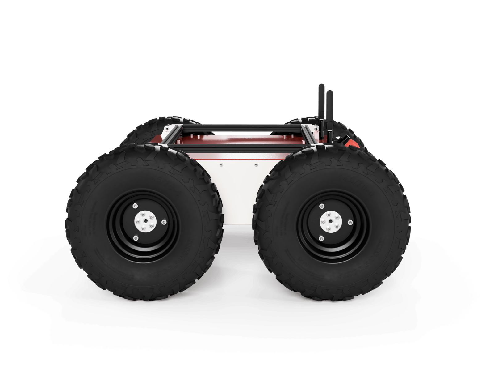

# Panther robot simulation

This repo contians the necessary packages required for the simulation of the Husarion's Panther robot.



## Execution
Rebuild and source the workspace properly
```shell
colcon build --packages-select husarion_components_description
```
Sourcing the workspace to update package paths
```shell
source install/setup.bash
```
Start the siumlation:
```shell
ros2 launch husarion_ugv_gazebo simulation.launch.py
```

### Usefull repos
- STL file for the Ouster lidar sensor can be found in the [ouster-gazebo-simulation](https://github.com/Gepetto/ouster-gazebo-simulation) project on GitHub. Converted to DAE using the Blender app.

### To-do
- <del>Integrate mesh instead of simple visual cylinder for the Ouster lidar
- Add black zone to lidar DAE file using Blender
- Add lidar bracker to Panther robot

### Environment
- Ubuntu 22
- ROS 2 Humble
- Gazebo Fortress