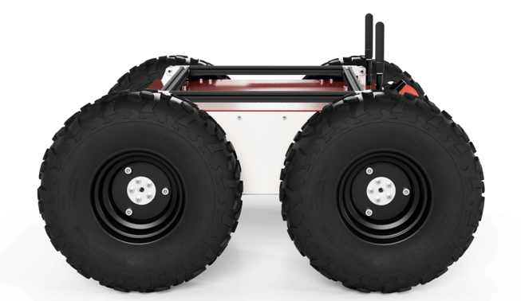

# Panther robot simulation

This repo contians the necessary packages required for the simulation of the Husarion's Panther robot.



## Execution
Build and source the workspace properly (e.g. for the specific package "husarion_components_descroption)
```shell
colcon build --packages-select husarion_components_description
```
Sourcing the workspace to update package paths
```shell
source install/setup.bash
```
Start the siumlation:
```shell
ros2 launch husarion_ugv_gazebo simulation.launch.py
```

Method 1: Direct launch of the simulation in a specific custom world (e.g. DARTeC):
```shell
ros2 launch husarion_gz_worlds gz_sim.launch.py gz_world:=/home/bender/husarion_ws/src/husarion_gz_worlds/worlds/my_custom_world.sdf
```
Method 2: With Installation Path (After build)
```shell
ros2 launch husarion_gz_worlds gz_sim.launch.py gz_world:=$(ros2 pkg prefix husarion_gz_worlds)/share/husarion_gz_worlds/worlds/dartec.sdf
```

How to stop gazebo
```shell
pkill -f "ign gazebo"
```

### Usefull repos
- STL file for the Ouster lidar sensor can be found in the [ouster-gazebo-simulation](https://github.com/Gepetto/ouster-gazebo-simulation) project on GitHub. Converted to DAE using the Blender app.

### To-do
- <del>Integrate mesh instead of simple visual cylinder for the Ouster lidar
- Add black zone to lidar DAE file using Blender
- <del>Add lidar bracker to Panther robot
- <del>Create custo world (dartec) and spawn panther inside
- Fine-tune dartec world

### Environment
- Ubuntu 22
- ROS 2 Humble
- Gazebo Fortress

### Husarion's Panther on GitHub
- [husarion_ugv_ros](https://github.com/husarion/husarion_ugv_ros)